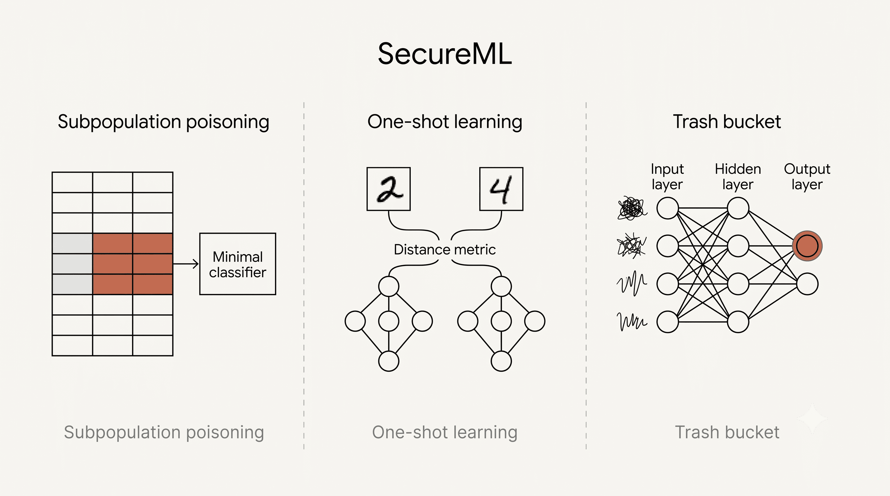

# SecureML

Research implementations exploring **machine learning security**, with a focus on the **subpopulation data poisoning attacks**, **one-shot learning**, and **trash-bucket problem**.

This project was developed as an Independent Study Module (ISM) at Ashoka University. It studies how standard ML pipelines can be exploited when an adversary controls a small, targeted subset of training data.

## ISM Deliverables

| Deliverable | Description |
|-------------|-------------|
| [Final presentation (PDF)](docs/final-presentation.pdf) | End-to-end survey of subpopulation data poisoning, one-shot learning, and trash-bucket behavior |
| [Subpopulation attack summary (PDF)](docs/subpopulation-attack-summary.pdf) | Literature review and notes on Koh et al. (2020) |

## Overview

The project spans three threads of ML security research: poisoning a targeted subgroup of training data, learning from few examples with Siamese networks, and exposing how training order biases models toward a "trash bucket" output on unrecognizable inputs. The figure below maps each thread to its core idea.



| Area | Description | Notebooks |
|------|-------------|-----------|
| **Subpopulation poisoning** | Replication and extension of targeted subpopulation attacks on tabular data | [`subpopulation_attack_paperimplementation.ipynb`](notebooks/subpopulation_attack/subpopulation_attack_paperimplementation.ipynb), [`Subpopulation_Stroke.ipynb`](notebooks/subpopulation_attack/Subpopulation_Stroke.ipynb) |
| **One-shot learning** | Siamese networks for few-shot classification on MNIST and Omniglot | [`One_Shot_Learning_MNIST.ipynb`](notebooks/one_shot_learning/One_Shot_Learning_MNIST.ipynb), [`one_shot_learning_omniglot.ipynb`](notebooks/one_shot_learning/one_shot_learning_omniglot.ipynb) |
| **Trash bucket** | Demonstrates how ordered or biased training data causes models to misclassify specific inputs | [`dogvscat.ipynb`](notebooks/trash_bucket/dogvscat.ipynb), [`MNIST_Trash_Bucket.ipynb`](notebooks/trash_bucket/MNIST_Trash_Bucket.ipynb), [`mnist_trashbucket_randomimagestesting.ipynb`](notebooks/trash_bucket/mnist_trashbucket_randomimagestesting.ipynb) |

## Datasets & Sources

Dataset files are **not** included in this repository. Download from the sources below and place them under `data/`.

### Subpopulation poisoning

| Dataset | Source | Local path |
|---------|--------|------------|
| UCI Adult | [UCI ML Repository](https://archive.ics.uci.edu/ml/datasets/adult) (CC BY 4.0) | `data/adult/adult.data`, `data/adult/adult.test` |
| Credit Risk | [Kaggle](https://www.kaggle.com/laotse/credit-risk-dataset) | `data/credit_risk/credit_risk_dataset.csv` |
| Stroke Prediction | [Kaggle](https://www.kaggle.com/fedesoriano/stroke-prediction-dataset) | `data/stroke/healthcare.csv` |

### One-shot learning

| Dataset | Source | Local path |
|---------|--------|------------|
| MNIST | [Yann LeCun's MNIST](http://yann.lecun.com/exdb/mnist/) | Auto-downloaded via `tf.keras.datasets.mnist` |
| Omniglot | [Brenden Lake's repository](https://github.com/brendenlake/omniglot) (MIT) | `data/omniglot/` |

### Trash bucket

| Dataset | Source | Local path |
|---------|--------|------------|
| Dogs vs. Cats | [Kaggle competition](https://www.kaggle.com/c/dogs-vs-cats/data) | `data/dogvscat_traindata/` |
| Animal Faces (OOD) | [Kaggle dataset](https://www.kaggle.com/andrewmvd/animal-faces) | `data/dogvscat_traindata/another_dataset/` |

### Setup notes

- **Dogs vs. Cats** — extract `train.zip` into `data/dogvscat_traindata/train/`.
- **Animal Faces** — extract wild-animal images to `data/dogvscat_traindata/another_dataset/train/wild/`.
- **Omniglot** — copy the repository's `data/` folder to `data/omniglot/data/`; optional Siamese weights go in `data/omniglot/oneshot/weights/`.
- **UCI Adult** — place `adult.data` and `adult.test` in `data/adult/` (`adult.names` is included in this repo).
- **Stroke Prediction** — save Kaggle's `healthcare-dataset-stroke-data.csv` as `data/stroke/healthcare.csv`.
- **MNIST** — fetched automatically on first run via TensorFlow.
- **Model artifacts** (optional) — pre-trained dog/cat models and test images can be placed in `data/dogvscat/`, or generated by running the training cells in `dogvscat.ipynb`.

## Repository structure

```
secureml/
├── notebooks/
│   ├── trash_bucket/          # CNN trash-bucket experiments (dogs/cats, MNIST)
│   ├── one_shot_learning/     # Siamese network implementations
│   └── subpopulation_attack/  # Data poisoning on tabular datasets
├── data/                      # Dataset files (not tracked — see Datasets & sources)
├── assets/                    # Project overview image
├── docs/                      # ISM deliverables (PDFs)
├── LICENSE
└── requirements.txt
```

## Getting started

### Prerequisites

- Python 3.8 or 3.9 (pinned dependencies below were tested on these versions; newer Python releases may require adjusted package versions)
- pip

### Installation

```bash
git clone https://github.com/kubershahi/secureml.git
cd secureml
python -m venv .venv && source .venv/bin/activate  # optional
pip install -r requirements.txt
```

### Running experiments

Launch Jupyter from the repository root and open notebooks under `notebooks/`:

```bash
jupyter notebook
```

Run cells in order. Notebooks that depend on local data require the datasets listed above to be placed under `data/` first.

## References

### Papers

| Topic | Reference |
|-------|-----------|
| Subpopulation data poisoning | Koh, P., et al. [*Stronger Data Poisoning Attacks Break Data Sanitization Defenses*](https://arxiv.org/abs/2006.14026). arXiv:2006.14026, 2020. |
| One-shot learning | Koch, G., et al. [*Siamese Neural Networks for One-shot Image Recognition*](https://www.cs.cmu.edu/~rsalakhu/papers/oneshot1.pdf). ICML Deep Learning Workshop, 2015. |

### Background reading

- Trash-bucket experiments and findings are summarized in the [final presentation](docs/final-presentation.pdf).
- Subpopulation attack methodology is reviewed in the [paper summary](docs/subpopulation-attack-summary.pdf).

## License

This project is licensed under the [MIT License](LICENSE).

Dataset files are subject to their respective licenses (see [Datasets & Sources](#datasets--sources)); only code and documentation in this repository are covered by the MIT License.
